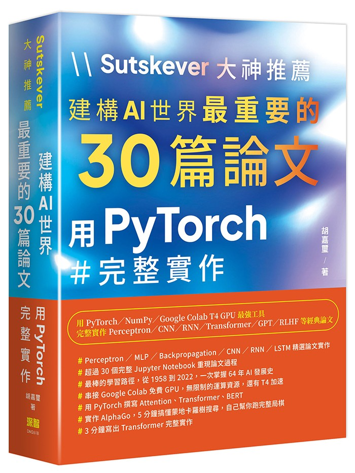

# Sutskever 大神推薦：建構 AI 世界最重要的 30 篇論文

## 用 PyTorch 完整實作

<p align="center">
  
</p>

> **深智數位 出版** ｜ 作者：胡嘉璽

Ilya Sutskever 曾開出一份「理解 AI 必讀的論文清單」，涵蓋了從基礎理論到最前沿模型的關鍵研究。本書精選其中 **30 篇最重要的論文**，每篇都附上完整的 **PyTorch 實作**，讓你不只讀懂論文，更能親手重現經典。

## 本書特色

- **30 篇經典論文**，從 Char-RNN 到 InstructGPT，完整覆蓋深度學習發展脈絡
- **每章獨立的 Jupyter Notebook**，可直接在 Google Colab 或本地環境執行
- **全中文註解與說明**（繁體中文・台灣用語），降低閱讀門檻
- **豐富的視覺化圖表**，超過 200 張圖片輔助理解模型架構與訓練過程
- **從理論到實作**，每章包含論文重點摘要、數學推導、程式碼實作與實驗結果

## 章節目錄

| 章節 | 論文主題 | 實作檔案 |
|:----:|----------|----------|
| 01 | 複雜動力學第一定律 | `complexity_pytorch.ipynb` |
| 02 | Char-RNN 文字生成 | `char_rnn_pytorch.ipynb` |
| 03 | LSTM 長短期記憶 | `lstm_pytorch.ipynb` |
| 04 | RNN Dropout 正則化 | `rnn_dropout_pytorch.ipynb` |
| 05 | 神經網路剪枝 | `pruning_pytorch.ipynb` |
| 06 | Pointer Networks | `pointer_networks_pytorch.ipynb` |
| 07 | AlexNet 影像分類 | `alexnet_pytorch.ipynb` |
| 08 | Seq2Seq 與集合 | `seq2seq_sets_pytorch.ipynb` |
| 09 | GPipe 管線平行化 | `gpipe_pytorch.ipynb` |
| 10 | ResNet 殘差網路 | `resnet_pytorch.ipynb` |
| 11 | 膨脹卷積 | `dilated_conv_pytorch.ipynb` |
| 12 | 圖神經網路 GNN | `gnn_pytorch.ipynb` |
| 13 | Transformer | `transformer_pytorch.ipynb` |
| 14 | Bahdanau 注意力機制 | `bahdanau_attention_pytorch.ipynb` |
| 15 | Identity ResNet | `identity_resnet_pytorch.ipynb` |
| 16 | Relation Networks | `relation_networks_pytorch.ipynb` |
| 17 | VAE 變分自編碼器 | `vae_pytorch.ipynb` |
| 18 | Relational RNN | `relational_rnn_pytorch.ipynb` |
| 19 | Coffee Automaton | `coffee_automaton_pytorch.ipynb` |
| 20 | Neural Turing Machine | `neural_turing_machine_pytorch.ipynb` |
| 21 | CTC 語音辨識 | `ctc_speech_pytorch.ipynb` |
| 22 | Scaling Laws 規模法則 | `scaling_laws_pytorch.ipynb` |
| 23 | GPT-3 語言模型 | `gpt3_pytorch.ipynb` |
| 24 | Vision Transformer | `vit_pytorch.ipynb` |
| 25 | DDPM 擴散模型 | `ddpm_pytorch.ipynb` |
| 26 | CLIP 圖文對齊 | `clip_pytorch.ipynb` |
| 27 | AlphaFold 蛋白質結構 | `alphafold_pytorch.ipynb` |
| 28 | DALL-E 文生圖 | `dalle_pytorch.ipynb` |
| 29 | Stable Diffusion | `stable_diffusion_pytorch.ipynb` |
| 30 | InstructGPT / RLHF | `instructgpt_pytorch.ipynb` |

## 環境需求

- Python 3.9+
- PyTorch 2.0+
- Jupyter Notebook / JupyterLab
- matplotlib、NumPy

```bash
# 使用 uv 安裝依賴
uv pip install torch numpy matplotlib jupyter
```

每個 notebook 皆可直接在 **Google Colab** 上執行，無需本地設定。

## 使用方式

```bash
# 複製本倉庫
git clone https://github.com/joshhu/joshhuilya30.git
cd joshhuilya30

# 開啟特定章節
jupyter notebook ch13/transformer_pytorch.ipynb
```

## 購買本書

### 實體書

| 通路 | 連結 |
|------|------|
| 天瓏書局 | https://www.tenlong.com.tw/products/9786267757956 |
| 博客來 | https://www.books.com.tw/products/0011047042 |

### 電子書

| 平台 | 連結 |
|------|------|
| iRead 灰熊愛讀書 | https://www.iread.com.tw/Detail/ProdDetail/B001179561 |
| BOOKWALKER | https://www.bookwalker.com.tw/product/290992 |
| Readmoo 讀墨 | https://reurl.cc/8eW8YX |

## 授權

本書程式碼僅供學習與研究使用。書籍內容版權屬深智數位所有。
